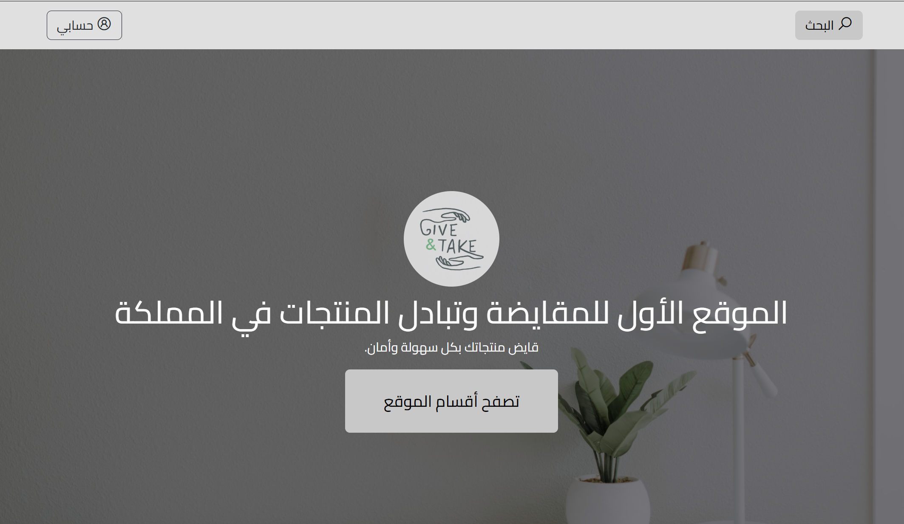
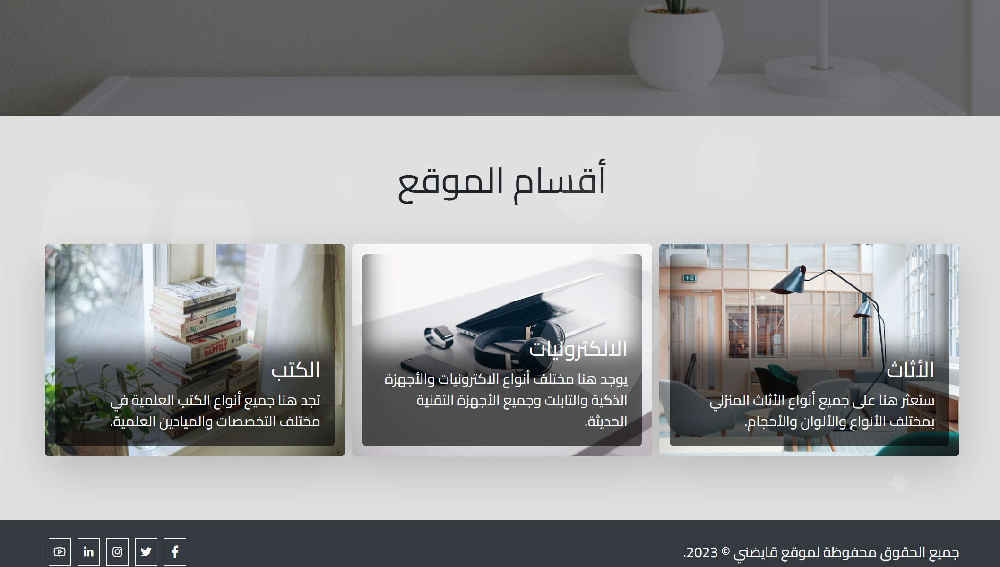
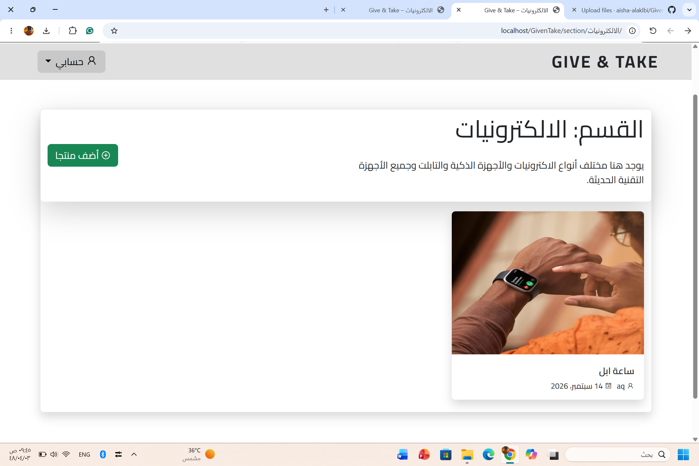
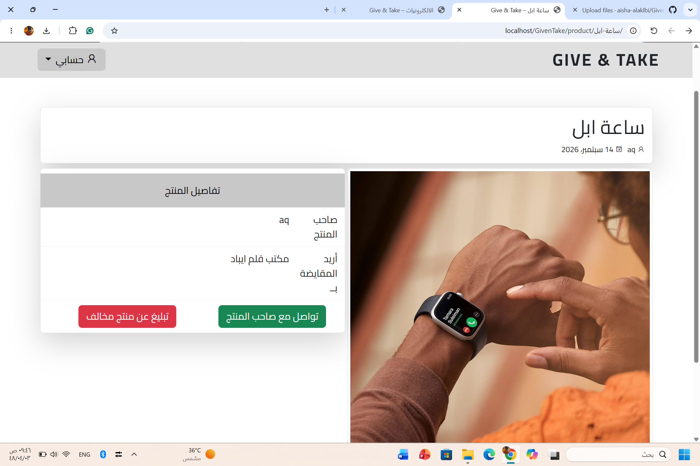
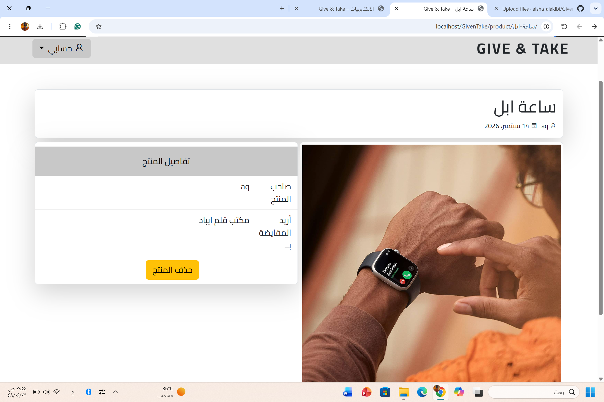
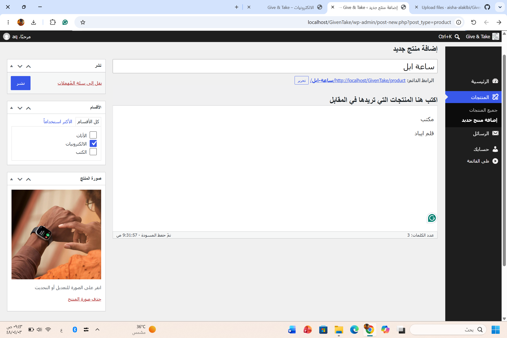
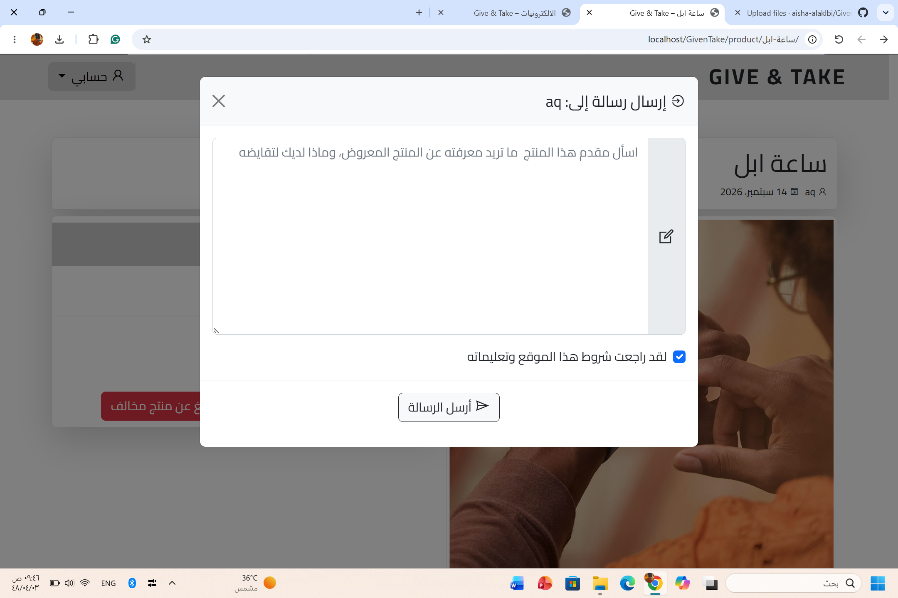

# Give & Take

Give & Take is a web-based barter platform developed as a Computer Science graduation project at the University of Bisha.

The project was created to provide a practical way for people to exchange useful items they no longer need for other items they want — without relying on traditional buying and selling.

## About the Project

With the growth of e-commerce and consumer purchasing, many usable products such as clothes, books, bags, shoes, and electronic devices are often left unused or discarded while still in good condition.

Give & Take applies the concept of barter to this problem by providing a digital platform where users can offer their unused products and exchange them with other users.

The goal is to make bartering easier and more accessible while encouraging better use of available resources, reducing unnecessary product waste, and supporting cooperation between members of the community.

## Project Objectives

- Facilitate the barter process regardless of time and location
- Allow users to benefit from goods without traditional financial transactions
- Reduce waste of usable products
- Help users obtain products they need at minimal cost
- Encourage mutual benefit, cooperation, and resource reuse
- Organize the exchange process through an accessible web platform

## Key Features

- User registration and account management
- Browse available products
- Add products for barter
- Select products users are interested in exchanging
- Organize products by categories for easier browsing
- Communicate through instant messaging
- User-focused accessibility considerations
- Product and user management
- Reporting functionality
- Database-driven storage and management of platform information

## System Development

The project followed a structured development process that included:

1. Identifying the problem and defining project objectives
2. Collecting and analyzing user requirements
3. System analysis and defining functional and non-functional requirements
4. Designing system models, database tables, and relationships
5. Designing and implementing the web interface
6. Integrating the application with the database
7. Testing, troubleshooting, and maintaining the system

User research was also conducted through a questionnaire that received more than 900 responses and helped validate the need for the platform and guide its requirements.

## Technologies Used

- PHP
- MySQL
- HTML5
- CSS
- JavaScript
- WordPress

## Database

The platform uses a relational MySQL database to manage application data such as:

- Users
- Products
- Categories
- Messages
- Reports

Database tables and relationships were designed as part of the system design and implementation process.

## My Contribution

As a member of the development team, I contributed across multiple stages of the project, including:

- Requirements and system analysis
- Database and system design
- Web application development
- Database integration
- Testing and troubleshooting
- Technical documentation

A key technical contribution was identifying and resolving a logic-level issue that prevented the application from accessing its database correctly. I traced the issue through the existing codebase, corrected the underlying logic, and validated that database access and application functionality were restored.

This project strengthened my practical experience in software development, database integration, debugging, root-cause analysis, system analysis, and collaborative project development.

## Project Context

Give & Take was developed as a Bachelor's graduation project in Computer Science at the University of Bisha.

This repository preserves the original implementation as part of my software development portfolio.

## Screenshots

### Home Page

### Product Sections

### Products

### Product Details - Customer View

### Product Details - Owner View

### Add Product

### Instant Chat

